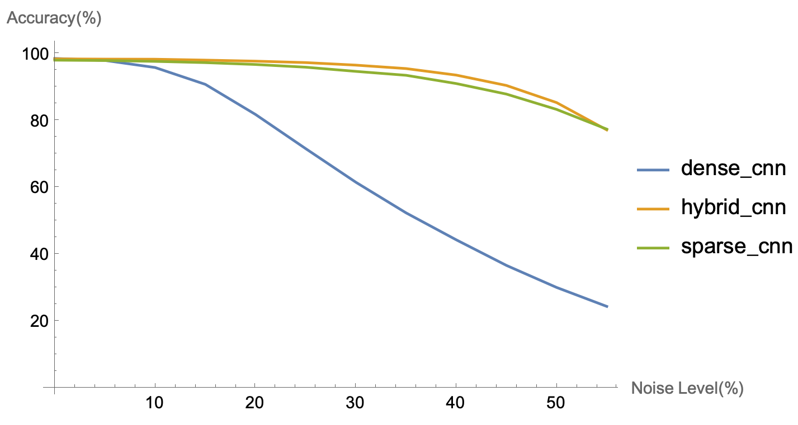

# How Can We Be So Dense
This is an implementation of [How Can We Be So Dense? The Benefits of Using Highly Sparse Representations](https://arxiv.org/abs/1903.11257).

## Models
Sparse CNN and Dense CNN are the models described in the paper. 
Hybrid CNN is minimally modified from Dense CNN to perform well on the noisy MNIST data.
The image below shows the performance of the three models, which can be reproduced by running `train_evaluate_noise.py`.
